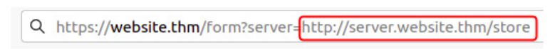
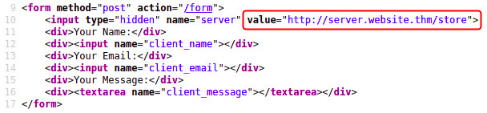
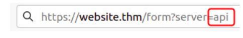
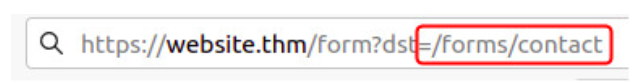

# Room: Intro to SSRF

## Key Concept

**SSRF (Server-Side Request Forgery):**
- SSRF is a vulnerability where the server is tricked into making an HTTP request to a resource chosen by the attacker.
- This allows attackers to interact with internal systems that are not directly accessible.

##### Types of SSRF:
- **Regular SSRF**: The server's response is returned to the attacker.
- **Blind SSRF**: The request is made, but the attacker receives no direct response (response is suppressed).

#### Spotting SSRF:
- When a full URL is used in parameter in address bar
- 
- A hidden field in a form:
- 
- partial URL such as hostname:
- 
- or even the path of the URL
- 

**Deny List:**
- Deny lists allow **all requests except** those that match blocked patterns or values.
- Used to prevent access to sensitive targets such as:
  - `localhost`, `127.0.0.1`, internal APIs, or cloud metadata services.
- Common bypass techniques:
  - Use alternate IP formats or encodings:
    - `0`, `0.0.0.0`, `127.1`, `127.*.*.*`, `2130706433` (decimal), `017700000001` (octal)
    - DNS-based subdomains like: `127.0.0.1.nip.io`
  - Cloud metadata bypass:
    - IP: `169.254.169.254`
    - Bypass by registering a domain/subdomain pointing to it.

**Allow List:**
- Allow lists **deny all requests except** those that match a defined pattern or domain.
- Example: Only URLs starting with `https://website.thm` are allowed.
- Bypass:
  - Use a subdomain trick:
    - `https://website.thm.attackers-domain.thm` would pass the allow list check if the logic only checks the prefix.

**Open Redirect:**
- An **open redirect** is a server endpoint that takes a URL and redirects the user to it.
- Example: `https://website.thm/link?url=https://tryhackme.com`
- Bypass method:
  - If SSRF protection only allows URLs beginning with `https://website.thm/`
  - An attacker can use the redirect feature to point the request **first to the open redirect**, which then forwards to the malicious domain.
  - This can be used to bypass even strict allow list SSRF protections.

##### Impact:
- Access to internal network services and private IPs.
- Exposure of sensitive data like internal dashboards or metadata endpoints.
- Potential for lateral movement within the internal infrastructure.
- Leakage of authentication credentials or internal tokens.

## Tools / commands

*No specific tools/commands covered yet in this section.*
